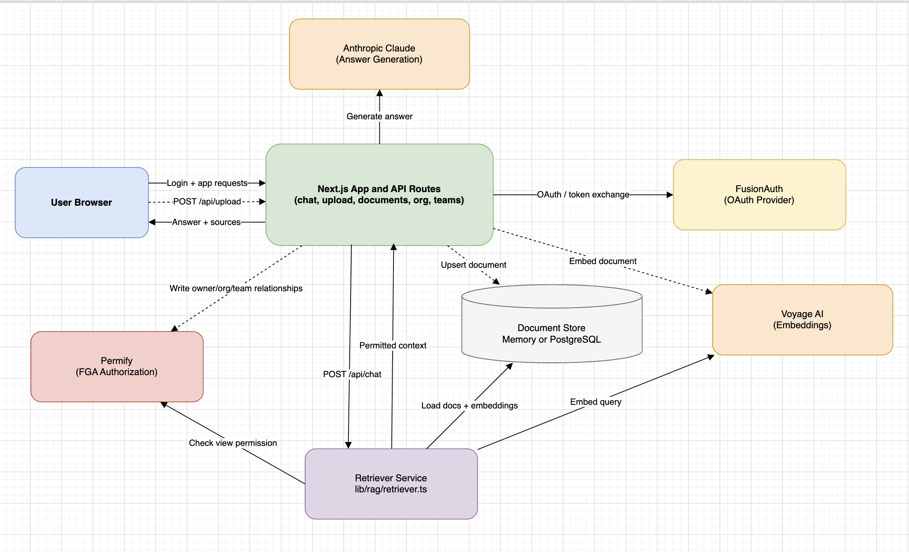

# FusionAuth FGA + RAG Example

A Next.js chat application that combines **FusionAuth** for authentication, **Permify** for fine-grained authorization (FGA), and a RAG pipeline for retrieval-augmented generation. Users can only query documents they have permission to access -- permissions are enforced _before_ documents reach the LLM, so unauthorized content is never exposed.

## Prerequisites

- [Docker](https://docs.docker.com/get-docker/) and Docker Compose
- [Node.js](https://nodejs.org/) 18+
- An API key for at least one AI provider (see [LLM/Embedding Providers](#llmembedding-providers))

## Quick Setup

```bash
# Start infrastructure (FusionAuth, Permify, PostgreSQL)
docker compose up -d

# Install dependencies
npm install

# Copy environment file (defaults work out of the box with kickstart)
cp .env.example .env

# Start the dev server
npm run dev

# Seed Permify schema, relationships, and sample documents
npm run seed:all
```

Open [http://localhost:3000](http://localhost:3000). Sign in with one of the seed users or create a new account.

### Seed Users

All seed users share the password `password`.

| User | Email | Org Role | Team |
|------|-------|----------|------|
| Admin | `admin@example.com` | admin | -- |
| Jane | `jane@example.com` | member | Customer Support (lead) |
| John | `john@example.com` | member | Fraud and Security (lead) |
| Sarah | `sarah@example.com` | member | Customer Support |
| Mike | `mike@example.com` | member | Customer Support |
| Emily | `emily@example.com` | member | Fraud and Security |
| Carlos | `carlos@example.com` | member | Fraud and Security |
| Rachel | `rachel@example.com` | member | Disputes/Chargebacks (lead) |
| David | `david@example.com` | member | Disputes/Chargebacks |
| Lisa | `lisa@example.com` | member | Disputes/Chargebacks |
| Tom | `tom@example.com` | member | Loan Servicing (lead) |
| Priya | `priya@example.com` | member | Loan Servicing |
| Stranger | `stranger@example.com` | -- | -- |

New users who register through FusionAuth are automatically added as members of the organization.

## High-Level Architecture

This project is a Next.js application that enforces authorization before RAG context reaches the LLM.

### Core Components

- **Web app (Next.js App Router)**: UI pages and API routes (`/api/chat`, `/api/documents`, `/api/upload`, org/team management).
- **Authentication (FusionAuth + NextAuth)**: OAuth login, token/session handling, and first-login organization membership bootstrap.
- **Authorization (Permify)**: Relationship-based access checks (`view`, `edit`, `admin`, `member`, `lead`, `owner`, `viewer`, team/document relationships).
- **RAG Pipeline (Retriever + AI Client)**: Embedding generation, similarity search, permission filtering, and answer generation.
- **Document Store**:
	- In-memory (default, non-durable)
	- PostgreSQL via `DOCUMENTS_DATABASE_URL` (durable)
- **LLM/Embedding Providers**:
	- OpenAI for chat and embeddings (default, set `AI_PROVIDER=openai`)
	- Anthropic Claude for chat + Voyage AI for embeddings (set `AI_PROVIDER=anthropic`)

### System Architecture



### Request Flow Summary

1. User authenticates through FusionAuth (via NextAuth provider).
2. User sends a chat query to `/api/chat`.
3. Retriever embeds the query, ranks candidate documents by similarity, then asks Permify which documents the user can `view`.
4. Only permitted documents are passed as context to the LLM.
5. API returns answer and source document IDs.

This "authorize before generate" model is the key security property of the system.

## APIs

### Chat

| Method | Endpoint | Description |
|--------|----------|-------------|
| `POST` | `/api/chat` | Send a query -- returns an answer generated from permitted documents |
| `GET` | `/api/chat/history` | List the current user's conversations |
| `GET` | `/api/chat/history/[id]` | Get a specific conversation with messages |

### Documents

| Method | Endpoint | Description |
|--------|----------|-------------|
| `GET` | `/api/documents` | List all documents the current user can access |
| `POST` | `/api/upload` | Upload a new document (auto-linked to the organization) |

### Organization

| Method | Endpoint | Description |
|--------|----------|-------------|
| `GET` | `/api/organization` | Get organization details and member list |
| `POST` | `/api/organization/members` | Add a member by email _(admin only)_ |
| `DELETE` | `/api/organization/members` | Remove a member _(admin only)_ |
| `POST` | `/api/organization/admins` | Promote a member to admin _(admin only)_ |
| `DELETE` | `/api/organization/admins` | Demote an admin _(admin only)_ |

### Teams

| Method | Endpoint | Description |
|--------|----------|-------------|
| `GET` | `/api/teams` | List all teams with members |
| `POST` | `/api/teams/members` | Add a member to a team by email _(admin only)_ |
| `DELETE` | `/api/teams/members` | Remove a member from a team _(admin only)_ |
| `POST` | `/api/teams/lead` | Promote a team member to lead _(admin only)_ |
| `DELETE` | `/api/teams/lead` | Demote a team lead _(admin only)_ |

### Auth

| Method | Endpoint | Description |
|--------|----------|-------------|
| `*` | `/api/auth/[...nextauth]` | NextAuth OAuth callbacks (FusionAuth provider) |
| `GET` | `/api/logout` | Redirect to FusionAuth logout |

## Document Persistence

By default, uploaded documents are stored in memory only. For durable storage (required in Railway or any multi-instance deployment), set:

```bash
DOCUMENTS_DATABASE_URL=postgres://<user>:<password>@<host>:<port>/<database>
```

When `DOCUMENTS_DATABASE_URL` is set, documents and embeddings are stored in PostgreSQL and survive restarts/redeploys.

## Contributors

- [FusionAuth](https://fusionauth.io) -- Authentication and user management
- [Permify](https://permify.co) -- Fine-grained authorization (ReBAC)
